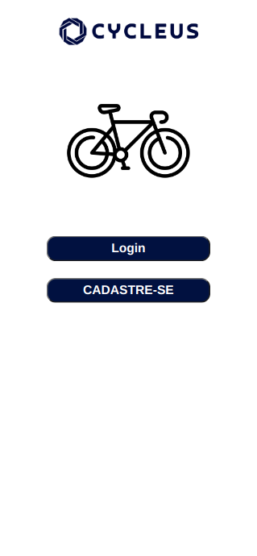
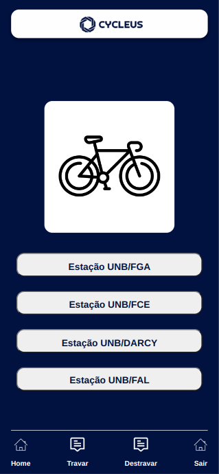
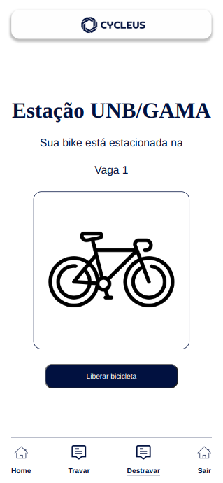

# Bem-vindo ao CYCLEUS!

O CYCLEUS é um bicicletário eletrônico desenvolvido para a comunidade acadêmica da UnB.

## Guia de utilização do sistema

|

##### O primeiro passo é se cadastrar no sistema

- Clique em "CADASTRE-SE"

##### Faça o seu cadastro

- Crie sua conta no CYCLEUS com o seu email institucional. ####@unb.br | ####@aluno.unb.br

##### Faça o login no sistema

- Após se registrar vá para a tela de login e insira suas credenciais

##### Seleciona a estação da sua localização

- Na tela principal selecione a estação desejada para utilizar o bicicletário(atualmente só a da FGA está em funcionamento)

##### Selecione a vaga desejada e leia o qrcode

- Na tela da estação você deve selecionar a vaga que será utilizada e clicar no botão de ler o QR Code liberando a câmera para ler o QR Code que se encontra no gabinete da estação.

##### Destrave sua bicicleta

- Quando for desejado destrave sua bicicleta clicando no botão "Liberar bicicleta"
- Esta aba de destravar pode ser acessada via botão "Destravar" no footer

## [Acesse o CYCLEUS]()
